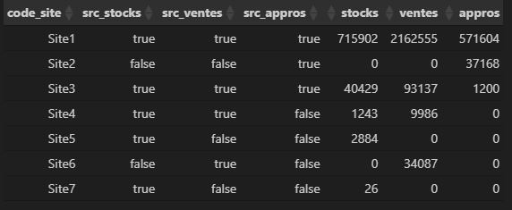
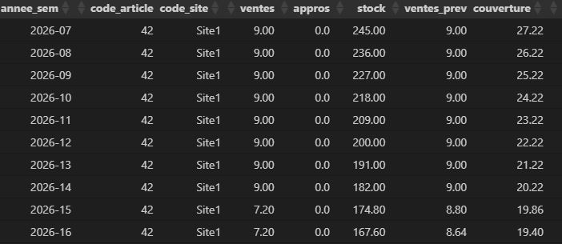
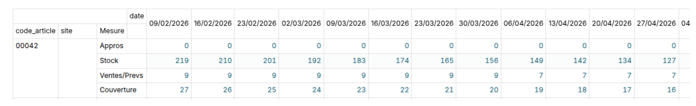
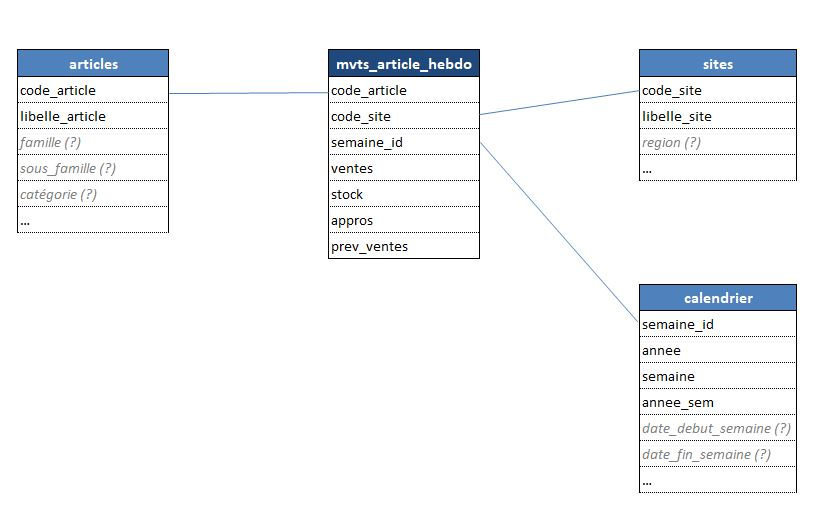

Démo mise en place pipeline de données
==============================

**Objectifs :**  
Produire un fichier CSV de sortie contenant une ligne par produit, par site et par semaine, depuis la semaine courante jusqu’à la dernière semaine contenant des données.

Chaque ligne devra contenir au minimum les informations suivantes : l’identifiant du produit, l’identifiant du site, la semaine, le stock de fin de semaine, le total des ventes de la semaine, le total des approvisionnements de la semaine, ainsi qu’un indicateur de couverture.

I. Analyse exploratoire *(cf src/tests/ana_expl.ipynb)*
------------

Utilisation d'un notebook pour une analyse rapide des données mises à disposition.  
Utilisation de pandas pour la manipulation des données et itables pour visualitaion dataframe  
Visualisation très sommaire des données avec Seaborn

Objectifs :
- Prise en main des données  
- Définition des actions de transformation / nettoyage à réaliser  
- Analyse des règles métiers à appliquer / valider  

## 1. Stocks
Aucune notion de date, correspond à la valeur initiale (démarrage)

Aucune donnée manquante & aucune ligne dupliquée dans le fichier

**Fonctionnement :**   code article + code site
- 1 article peut être affecté à plusieurs sites  
- Chaque site dispose d’un stock propre, indépendant des autres
*exemples : 835, 930, 1290, ...*  
🔵 Règle métier à valider avec le client

**Quantité :**  format float
- 97% des quantités de stocks sont entières  
🔵 Format float à confirmer par le client  
🔵 Valeurs extrèmes à valider avec le client (plausibles ou erreurs ?)**

**Sites :**
- 5 sites dont 3 avec peu de données et de stocks (*encore actifs ?*)  
🔵 Choix à valider avec le client (*cf.I.4. champs communs*)
    
**🟢 Choix fonctionnels pour démo :**
- Fichier propre, pas d'actions particulières à effectuer
- Conservation fonctionnement code article + code site
- Conservation de l'ensemble des données (*postulat : pas de données abérrantes*)

**🟠 Choix techniques pour démo :**
- Conservation du format float pour quantité stocks (*avec arrondi à 2 chiffres après la virgule*)
- Renommer champs quantite en stock_init

## 2. Appros
Aucune donnée manquante mais **des lignes dupliquées**  
🔵 Voir avec le client si normal (cf. fonctionnement) 
*exemple : article 1766 pour Site1 le 07/03/2026*

**Fonctionnement :**  
- Plusieurs appros possibles par jour et par clé article / site  
🔵 Règle métier à valider avec le client

**Code article :**  format string  
- 1 valeur non numérique (FRAIS3F)  
🔵 Anomalie potentielle à valider avec le client (impact sur le format commun du champs article)

**Sites :**  
- 3 sites dont 1 avec très peu d'articles approvisionnés  
🔵 Choix à valider avec le client (*cf.I.4. champs communs*)

**Quantité :**  
- 2 valeurs extrèmes correspondant à des lignes doublonnées  
🔵 contrôle à effectuer avec le client / dépendant du choix sur les données dupliquées

**🟢 Choix fonctionnels pour démo :**
- Conservation des doublons (*même commande passée à plusieurs fournisseurs ?*)
- Agrégation des approvisionnements par jour et par clé article / site 

**🟠 Choix techniques pour démo :**  
- Modification format pour champs [date] (str -> datetime)
- Modification format pour champs [code_article] (str -> int64) avec suppression 'anomalie'
    - *pour les 2 autres sources, le code article est numérique*
    - *1 seule valeur alphanumérique isolée*
    - *préferer les ID numériques aux ID String quand pas d'impact métier*
- Renommer champs quantite en appros

## 3. Ventes
Aucune donnée manquante & aucune ligne dupliquée dans le fichier

**Fonctionnement :**  
- 1 seule ligne par jour et par clé article / site  
🔵 Règle métier à confirmer avec le client

**🟢 Choix fonctionnels pour démo :**
- Fichier propre, pas d'actions particulières à effectuer

**🟠 Choix techniques pour démo :**
- Modification format pour champs [date] (str -> datetime)
- Conservation du format float pour quantité ventes (*avec arrondi à 2 chiffres après la virgule*)
- Renommer champs quantite en ventes

## 4. Champs communs

**Sites :**

Seuls 2 sites sont communs aux stocks / achats / ventes
🔵 Choix à valider avec le client (sites inactifs ? erreur extraction ?)

**Articles :** pour les sites communs aux stocks / achats / ventes
- Seul 38% des articles sur le site 1 sont présents dans les 3 sources
- Aucun article pour le site 3 n'est présent dans les 3 sources    
🔵 À creuser et à échanger avec le client

**dates :** pour les sites communs aux stocks / achats / ventes
- Période couverte ventes:
    - date min : 2026-02-09
    - date_max : 2026-12-28
- Période couverte appros:
    - date min : 2026-02-09
    - date_max : 2026-10-20  

La période couverte semble différente selon les sources  
🔵 À creuser et à échanger avec le client

**🟢 Choix fonctionnels pour démo :**
- Intégration uniquement des 2 sites communs aux stocks / achats / ventes (attente retour client)
- Intégration de l'ensemble des articles même ceux non présents dans toutes les sources  
*nouveaux articles pouvant ne pas avoir de stock, articles sans ventes ou appros pour la période, ...*
- Intégration uniquement des périodes communes (attente retour client)

**🟠 Choix techniques pour démo :**
- Pour les articles non présents dans certaine(s) source(s), remplacer les valeurs manquantes par 0
- Calcul de la période commune dynamiquement dans le code (vs fichier de paramétrage)

II. Transformation des fichiers sources
------------

**🟢 Choix fonctionnels pour démo :**
- Ensemble des choix listés lors de la phase exploratoire I.1, I.2 et I.3

**🟠 Choix techniques pour démo :**
- Ensemble des choix listés lors de la phase exploratoire I.1, I.2 et I.3
- Utilisation de pathlib et d'un fichier de config pour la gestion des chemins
- Utilisation d'un fichier de paramètrage
- Utilisation de pandas pour la manipulation des données
- Organisation du projet en dossiers / sous dossiers
- Sauvegarde des données transformées avant fichier de sortie
- 1 fichier .py par traitement (appros / stocks / ventes)

**Pour aller + loin :**
- Contrôle(s) automatique(s) à mettre en place ? 🔵 à définir avec le client
- Gestion des erreurs
- logs et infos traitements

III. Fichier de sortie
------------

**🟢 Choix fonctionnels pour démo :**
- Ensemble des choix listés lors de la phase exploratoire I.4
- Aggrégation des données par semaine (*en réponse à la demande*)
- Calcul du stock à fin de semaine selon le stock initial - ventes cumulées + appros cumulées
- Quand aucune vente n'a été réalisée, l'indicateur de couverture est mis par défaut à NULL  
🔵 à valider avec le client
- Aucun blocage sur les stocks négatifs  
🔵 à échanger avec le client

**🟠 Choix techniques pour démo :**
- Ensemble des choix listés lors de la phase exploratoire I.4
- Création d'une table 'calendrier' afin de s'assurer d'avoir l'ensemble des semaines (même celles sans ventes et appros). Cette table sera basée sur les périodes communes

**Focus Indicateur de couverture :**  
Métode de calcul :  
Prise en compte des ventes de l'ensemble des semaines précédentes  
Justification :  
Mise en place d'un système très simple et rapidement implémentable pour démarrer.  
**Mais** un modèle de machine learning de type série temporelle ou régression (*voir classification si l'objectif est un scoring de type risque de rupture à x semaines*) serait beaucoup + pertinent  
🔵 à cadrer avec le client

**Fichier de sortie :**

**Pour aller + loin :**
- Contrôle(s) automatique(s) à mettre en place ? 🔵 à définir avec le client
- Gestion des erreurs
- logs et infos traitements

IV. Schéma BDD
------------

Dans une optique d’exploitation en business intelligence et dans l'idée de faciliter la création du tableau illustré par l’image ci dessous :

Proposition d'un schéma en étoile avec :
- une table de fait (*mvts_articles_hebdo*)
- au minima 3 tables de dimension (*articles, calendrier et sites*)

